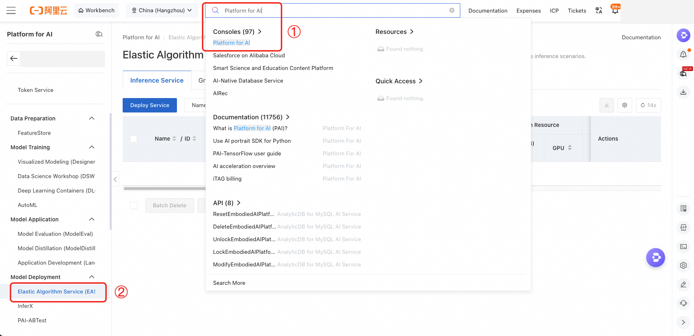
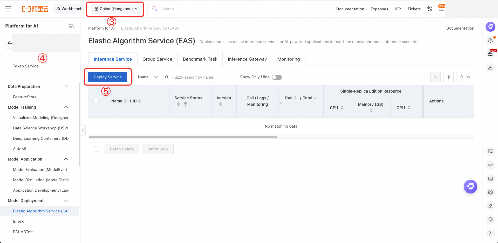
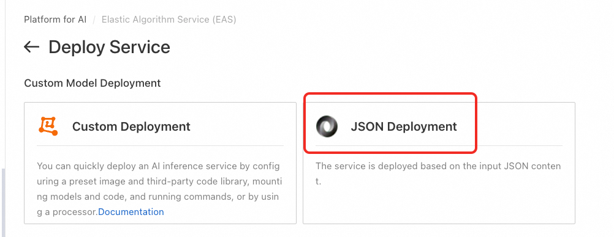

# Alibaba Cloud EAS Deployment Reference

This optional, provider-specific reference describes an Alibaba Cloud PAI/EAS JSON deployment for a model-serving environment with an EAS cache mount. It does not replace this artifact's fixed CacheFS image, Docker/FUSE workflows, or the validation claims in [Claims and Scope](claims-and-scope.md). Do not use deployment timing or serving behavior from this configuration as a paper-performance result.

The sample EAS image is accessible only from an evaluator-managed, authorized Alibaba Cloud EAS account. Obtain the model under its license, upload it to evaluator-controlled OSS, and provide no credentials, private host information, or model files in this repository.

## Prerequisites

- An Alibaba Cloud account authorized to use PAI and EAS in the selected region.
- An enabled EAS region and a workspace.
- An OSS location containing evaluator-obtained model files.
- Authorization to access the EAS VPC SGLang image shown below.
- GPU quota compatible with the requested tensor-parallel size. This example requests four GPUs and uses `--tp 4`; adjust both values together for another instance shape.

## Console steps

1. Search for **Platform for AI** in the Alibaba Cloud console and open it. On first use, authorize the required PAI RAM permissions for the account.
2. In the left navigation panel, select **Elastic Algorithm Service (EAS)**.
3. Select a region. Enable it if this is the account's first use of that region.
4. Create a workspace. Its `workspace_id` is required for JSON deployment.
5. Select **Deploy Service**, then select **JSON Deployment**.

The figures below mark the same sequence. Account and workspace identifiers have been redacted.







## JSON deployment template

The following is JSONC so the required substitutions are documented inline. Remove `//` comments if the EAS console requires strict JSON before deployment. Replace the placeholder `workspace_id` and OSS path with resources in the evaluator's own account.

```jsonc
{
  "cloud": {
    "computing": {
      "instances": [
        {
          "type": "ecs.gn6e-c12g1.12xlarge"
        }
      ]
    }
  },
  "containers": [
    {
      "image": "eas-registry-vpc.cn-hangzhou.cr.aliyuncs.com/pai-eas/sglang:v0.5.14",
      "port": 8000,
      "script": "python3 -m sglang.launch_server --model-path /model_dir --tp 4 --trust-remote-code --host 0.0.0.0 --port 8000"
    }
  ],
  "metadata": {
    "accessibility": "public",
    "cpu": 48,
    "disk": 512,
    "gpu": 4,
    "instance": 1,
    "memory": 368000,
    "name": "cachefs_test",
    "rpc": {
      "keepalive": 60000
    },
    // Use the workspace ID created in console step 4.
    "workspace_id": "<workspace_id>"
  },
  "storage": [
    {
      "mount_path": "/data-oss",
      "oss": {
        // Enable OSS in the evaluator account and upload licensed model files.
        "path": "/YOUR/OSS/PATH"
      },
      "properties": {
        "resource_type": "model"
      }
    },
    {
      "cache": {
        // Size this for the selected model; 200G is sufficient for Qwen2.5-72B-Instruct.
        "capacity": "200G",
        "path": "/data-oss/Qwen2.5-72B-Instruct"
      },
      "mount_path": "/model_dir"
    }
  ]
}
```

## Scope and handling

- The EAS VPC image is an account-specific prerequisite, not a publicly pullable dependency of this binary-image artifact.
- The OSS path, workspace ID, generated service endpoint, credentials, and model data remain private to the evaluator account.
- This guide does not validate SGLang throughput, model quality, production readiness, or any published CacheFS performance number.
- For the artifact's reproducibility workflow, continue with the [README](../README.md) and [validation guide](validation.md).
